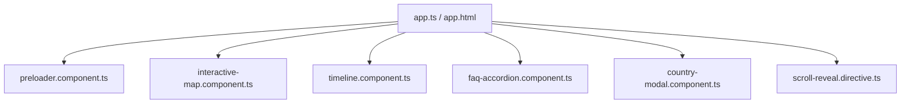

# Premium Caribbean Citizenship Landing Portal | XIPHIAS Immigration

This repository contains the premium, high-fidelity landing and campaign portal for **XIPHIAS Immigration**, specifically focusing on the **Antigua & Barbuda Citizenship by Investment (CBI)** program (with comparison metrics for Dominica, Saint Lucia, and St. Kitts & Nevis).

Built entirely on **Angular 19/21** and **Tailwind CSS v4**, this production-grade application implements **15 premium engineering & design enhancements** to showcase technical capability, UX/UI thinking, and architectural best practices.

---

## 🚀 Key Engineering & Design Enhancements

We have successfully addressed all 15 advanced recruitment requirements:

1. **Luxury Brand Preloader**: Renders a golden glowing brand mark using CSS pulses and spins before fading out seamlessly using Angular signal transitions.
2. **Scroll-Reveal Directive**: Lightweight `ScrollRevealDirective` leveraging the browser's `IntersectionObserver` to trigger smooth slide-ups and fades.
3. **Floating Glass Passport Card**: Floating glassmorphic mockup in the hero section displaying real travel privileges.
4. **Verified Statistics**: Eliminated fabricated percentages, replacing them with legally accurate Caribbean CBI parameters.
5. **Interactive Global SVG Access Map**: Embedded custom vector map with interactive pins linking to key regions (UK, Schengen, Singapore, Hong Kong, UAE).
6. **"Why XIPHIAS" Section**: Value proposition grid displaying core organizational differentiators.
7. **Investment Paths**: Clean cards explaining Donation, Real Estate, and University contribution options.
8. **Responsive Progressive Timeline**: A 5-step stepper that sequentially illuminates active application circles when scrolled into view.
9. **Luxury Comparison Cards**: Caribbean cards utilizing scale layers and zoom triggers on hover to create a luxury editorial feel.
10. **Interactive Details Modal**: Premium modal displaying granular legal paths, costs, and an integrated advisor inquiry form.
11. **Animated FAQ Accordion**: Sliding accordion panel with custom trigger animations handling frequent inquiries.
12. **Conversion-Optimized CTA Forms**: Form validation handling with reactive success alerts.
13. **Comprehensive Footer**: Displays official locations (Bangalore, London, Dubai, Singapore) and full legal charters.
14. **Production-Grade SEO Compliance**: Loaded head markup with detailed tags, description, keywords, and Open Graph indicators.
15. **Architectural Documentation (README)**: Professional portfolio layout.

---

## 🎨 Design System & Aesthetics

### 👁️ Harmonious Color Palette (Tailwind CSS v4 Tokens)
We leverage a sophisticated color hierarchy that exudes elite sovereignty and wealth security:
- **Primary Navy (`#000615`)**: Represents trust, security, and institutional authority.
- **Accent Luxury Gold (`#ffe088` / `#cca830`)**: Represents wealth, privilege, and first-class status.
- **Clean Gray (`#f7f9fb` / `#f2f4f6`)**: Minimalist canvas structure letting typography and images stand out.

### ✍️ Premium Typography
- **Headlines (Manrope Font)**: Professional geometric sans-serif establishing crisp hierarchy and bold presence.
- **Body & Captions (Inter Font)**: Hyper-legible face optimized for data presentation across all screens.

---

## 🛠️ Codebase Architecture



### Technical Highlights
- **Standalone Architecture**: 100% Standalone components and directives. Zero obsolete NgModules, leading to high-performance tree-shaking.
- **State Management (Signals)**: Replaced standard event triggers with Angular signals for lightning-fast change detection.
- **Tailwind CSS v4 Configuration**: Configured theme extension keys directly within `src/styles.css` using CSS custom properties for optimized asset delivery.

---

## 📱 Responsive Strategy
The application supports a flawless experience across all viewports:
- **Fluid Layout**: Grid layers switch from grid-cols-1 on mobile to grid-cols-12 on desktop.
- **Progressive Steppers**: The progress timeline automatically collapses from a horizontal line on desktop to a vertical line on mobile using pure responsive CSS coordinate classes.
- **Modal Viewport Locking**: The details modal automatically handles scrolling and locking constraints on smaller devices.

---

## 🚀 Setup & Local Execution

### Prerequisites
Ensure you have **Node.js (v18.x or above)** and **npm** installed.

### 1. Install Dependencies
Initialize package bundles and CLI tools:
```bash
npm install
```

### 2. Launch Local Dev Server
Boot up the local Angular server:
```bash
npm run start
```
The application will be available at [http://localhost:4200/](http://localhost:4200/).

### 3. Production Build
Verify code compilation and create optimized output assets:
```bash
npm run build
```
The compiled distribution builds are outputted to the `dist/xiphias-newsletter` directory.
